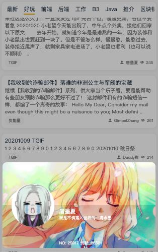
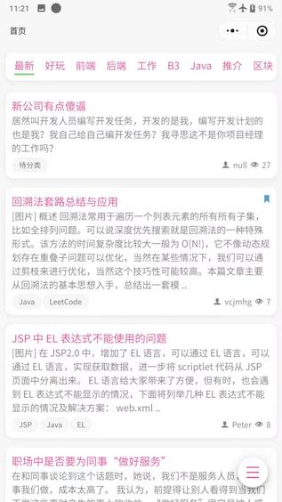

# 链滴微信小程序


#### 版本

- 0.0.1
  - 第一次提交
- 0.0.2
  - 支持两部验证登录
  - 增加尾巴定制
  - 优化消息通知获取业务逻辑
  - 修复标签显示问题
  - 增加新主题一套

#### 介绍
黑科派，链滴小程序
 
  

#### 技术栈

`Taro` `React` `Taro-UI` `Node.js`

#### 结构

比较关键位置文件说明，关于微信小程序的文件结构这里不再说明

```
src
├── app.config.ts
├── app.scss
├── app.tsx
├── assets
│   └── fonts
│       ├── icomoon.ttf
│       └── icon.scss
├── components  // 组件
│   └── parser // html 解析
├── index.html
├── net
│   ├── config.ts
│   └── index.ts
├── pages
│   ├── article
│   ├── comments
│   ├── domain
│   ├── index  // 首页
│   ├── index.tsx
│   ├── me
│   ├── meDetail
│   ├── notifications
│   ├── style.scss
│   ├── tagDetail
│   └── theme.json
├── test.js
└── tools // 工具封装
```

#### 运行

在 ld246 目录下

1.  `yarn global add @tarojs/cli`
2.  `yarn install`
3.  `yarn dev:weapp`

注意：需要自己去搭建小程序开发环境，有用到云函数。

#### 正式包编译

`yarn build:weapp`

> 可以使用 npm 不过本人并没试过，理论上讲没问题

#### 主要功能实现

- [x] 登录/验证码
- [x] 回帖
- [x] 个人信息
- [x] 首页
- [x] 标签详情页
- [x] 帖子详情页
- [x] 评论页
- [x] 领域列表页
- [x] 消息中心/提醒
- [x] 主题，暗色皮肤/皮肤切换/跟随微信自动切换
- [x] 设置页面
- [x] 字体大小切换
- [x] 自动签到

#### About

第一次尝试用 ts 写的。本人并不是一个专业的 H5 开发，从事 iOS 开发（虽然现在被公司压迫的做 H5 开发），如有迷惑代码行为请多多鞭策😏。
